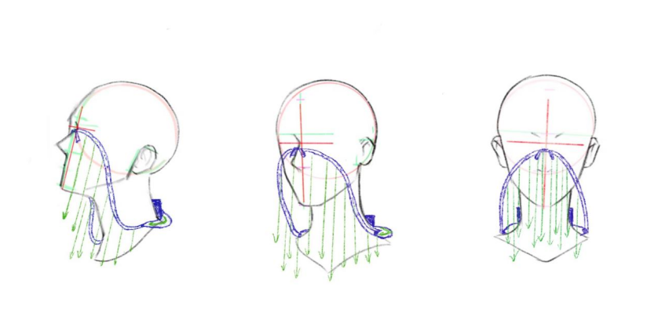
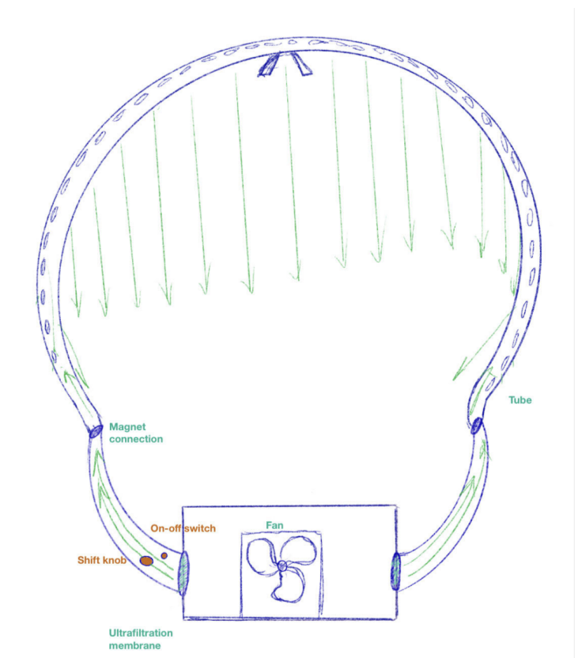

# Air Mask Prototype Control

This repository contains the source code for the **Air Mask Prototype Control** project. The project uses a joystick to control the speed of a fan, which is displayed as a percentage on a digital display. The fan speed is regulated based on the Y-axis movement of the joystick.

## Features

- **Joystick-Controlled Fan Speed**: Adjusts the fan speed based on the Y-axis input from the joystick.
- **Digital Display**: Displays the fan speed as a percentage (10% to 100%).
- **Motor Speed Regulation**: Controls the motor's speed using voltage adjustments.
- **Fixed Operation Time**: Operates for 20 seconds after activation.

## Project Structure

- **`AirMaskControl.c`**: The main source code file for the project.
- **Dependencies**:
  - LabJack UD driver for hardware interfacing.
  - Windows environment for compiling and running the code.

## How to Run

1. **Install Dependencies**:
   - Ensure the LabJack UD driver is installed on your system.
   - Set up a LabJack U3 device connected to your computer.

2. **Compile**:
   - Use a C compiler (e.g., GCC) to compile the `AirMaskControl.c` file.

3. **Run**:
   - Execute the compiled binary to start the fan control application.

## Hardware Requirements

- **LabJack U3**: For reading joystick inputs and controlling the fan and display.
- **Joystick**: Connected to the LabJack for input.
- **Fan (Motor)**: Controlled via DAC output to adjust speed.
- **Digital Display**: Shows the fan speed percentage.

## Future Improvements

- Enhance the code for error handling and calibration.
- Integrate additional features, such as X-axis control or external sensors.

## Screenshots

### Circuit Diagram

### Digital Display Output

## License

This project is licensed under the MIT License. See the [LICENSE](LICENSE) file for details.
